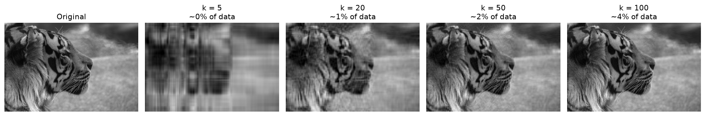
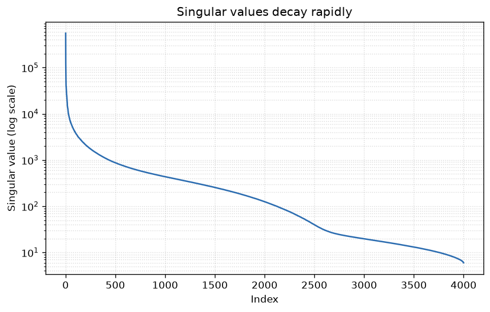

# Image Compression with SVD

Compressing a grayscale image using Singular Value Decomposition (SVD) — the linear algebra behind Principal Component Analysis (PCA).



## The idea

A 512×512 grayscale image is a matrix of 262,144 numbers. SVD factors that matrix into three components (U, Σ, Vᵀ) whose singular values are sorted by importance. By keeping only the top **k** singular values, we can reconstruct a close approximation of the image using a fraction of the original data.

With k = 20, the image above is stored using under **8% of the original data** — and is already clearly recognizable.

## Results

For a 512×512 image, a rank-k approximation stores `k × (512 + 512 + 1)` numbers instead of `512 × 512`, so the storage cost is `k × 1025 / 262144`.

| k (singular values kept) | Storage used | RMSE | Visual quality |
|---|---|---|---|
| 5   | ~2%  | 25.5 | Blurry, but recognizable |
| 20  | ~8%  | 15.0 | Good |
| 50  | ~20% | 9.5  | Nearly identical to original |
| 100 | ~39% | 5.9  | Indistinguishable |

The singular values decay rapidly, which is exactly why this works:



## How to run

```bash
git clone https://github.com/YOURUSERNAME/svd-image-compression.git
cd svd-image-compression
pip install -r requirements.txt
python3 compress.py
```

Replace `photo.jpg` with any image you like — it will be converted to grayscale automatically.

## What I learned

- How SVD decomposes a matrix into rank-1 components ordered by importance
- The connection between SVD and PCA (principal components are the right singular vectors of centered data)
- Low-rank approximation: the Eckart–Young theorem says the truncated SVD is the *best* possible rank-k approximation
- Practical NumPy: `np.linalg.svd`, matrix slicing, and broadcasting

## Tools

Python · NumPy · Matplotlib · Pillow
